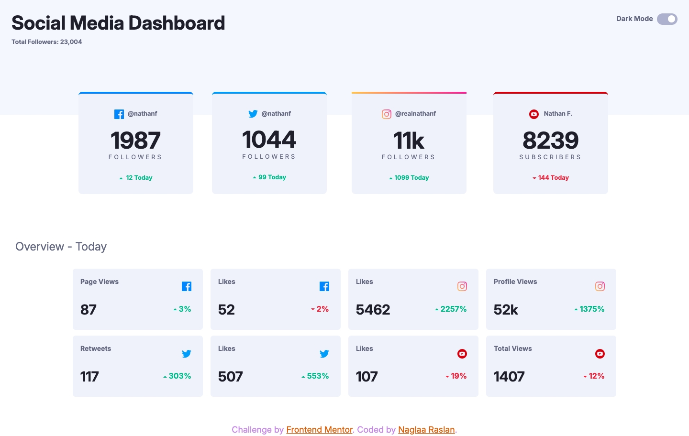
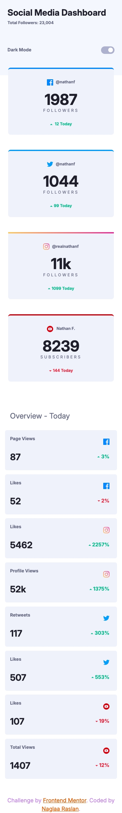

# Social-media-dashboard-with-theme-switcher
# Frontend Mentor - Social media dashboard with theme switcher solution

This is a solution to the [Social media dashboard with theme switcher challenge on Frontend Mentor](https://www.frontendmentor.io/challenges/social-media-dashboard-with-theme-switcher-6oY8ozp_H). Frontend Mentor challenges help you improve your coding skills by building realistic projects. 

## Table of contents

- [Overview](#overview)
  - [The challenge](#the-challenge)
  - [Screenshot](#screenshot)
  - [Links](#links)
- [My process](#my-process)
  - [Built with](#built-with)
  - [What I learned](#what-i-learned)
  - [Useful resources](#useful-resources)
- [Author](#author)

**Note: Delete this note and update the table of contents based on what sections you keep.**

## Overview

### The challenge

Users should be able to:

- View the optimal layout for the site depending on their device's screen size
- See hover states for all interactive elements on the page
- Toggle color theme to their preference

### Screenshot

- Desktop :;

- Ipad :

- Mobile :;

### Links

- Solution URL: [Github REpo](https://github.com/codeAndcocoa/Social-media-dashboard-with-theme-switcher.git)
- Live Site URL: [Live site](https://codeandcocoa.github.io/Social-media-dashboard-with-theme-switcher/)

## My process

### Built with
- Semantic HTML5 markup
- CSS custom properties
- Bootstrap 5
- Vanilla javascript
- Sass

**Note: These are just examples. Delete this note and replace the list above with your own choices**

### What I learned
- I learnt how to change the overall style and color scheme of the webpage and different elements as well;
- I learnt to colorize borders in linear gradients colors;

### Useful resources
- This resource help me to create borders in linear gradients:
https://michaelharley.net/posts/2021/01/12/how-to-create-a-border-top-linear-gradient/

## Author

- Website - [Github profile](https://github.com/codeAndcocoa)
- Frontend Mentor - [@codeAndcocoa](https://www.frontendmentor.io/profile/codeAndcocoa)

